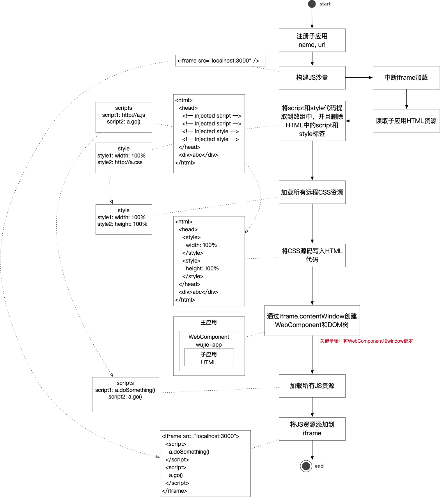

# 什么是微前端
微前端的概念是由ThoughtWorks在2016年提出的，它借鉴了微服务的架构理念，核心在于将一个庞大的前端应用拆分成多个独立灵活的小型应用，同时可以解决一些iframe的潜在问题。微前端解决方案也给我们提供如下特性：
- 单个前端部分可独立开发、测试和部署；
- 无需重新构建即可添加、移除或替换单个前端部分；
- 不同的前端部分可使用不同的技术构建；
- 解决iframe硬隔离的一些问题

# iframe
**优点**

- 非常简单，使用没有任何心智负担
- **web**应用隔离的非常完美，无论是**js**、**css**、**dom**都完全隔离开来

由于其**隔离的太完美**导致缺点也非常明显
**缺点**

- 路由状态丢失，刷新一下，**iframe**的**url**状态就丢失了
- **dom**割裂严重，弹窗只能在**iframe**内部展示，无法覆盖全局
- **web**应用之间通信非常困难
- 每次打开白屏时间太长，对于[SPA 应用](https://zh.wikipedia.org/wiki/%E5%8D%95%E9%A1%B5%E5%BA%94%E7%94%A8)来说无法接受
# single-spa
## 介绍
- 官网：[https://zh-hans.single-spa.js.org/](https://zh-hans.single-spa.js.org/)
## 子应用
main.js：
```javascript
import Vue from 'vue'
import App from './App.vue'
import router from './router'
import singleSpa from 'single-spa-vue';

Vue.config.productionTip = false

const appOptions = {
	el: '#microApp', // 挂载到父应用中的id为microApp的标签中
	router,
	render: h => h(App)
}
const vueLifeCycle = singleSpa({
	Vue,
	appOptions
})

// 如果是父应用引用子应用，就会有这个属性
if(window.singleSpaNavigate){
	__webpack_public_path__ = 'http://localhost:4001/'
}
// 如果不是父应用引用
if(!window.singleSpaNavigate){
	delete appOptions.el;
	new Vue(appOptions).$mount('#app');
}

// 子应用的生命周期，我们可以在不同的阶段做一些事情

export function bootstrap (props) {
	console.log('app1 bootstrap')
	return vueLifeCycle.bootstrap(() => {})
}

export function mount (props) {
	console.log('app1 mount')
	return vueLifeCycle.mount(() => {})
}

export function unmount (props) {
	console.log('app1 unmount')
	return vueLifeCycle.unmount(() => {})
}
```

.env.micro：
```bash
NODE_ENV=development
VUE_APP_BASE_URL=/child-vue1
VUE_APP_PORT=4001
```

package.json:
```json
{
  "scripts": {
    "serve": "vue-cli-service serve",
    "serve:micro": "vue-cli-service serve --mode micro"
  }
}
```

router.js:
```javascript
const router = new VueRouter({
	mode: 'history',
	base: process.env.VUE_APP_BASE_URL,
	routes
})
```
## 主应用

main.js：
```javascript
import Vue from 'vue'
import App from './App.vue'
import router from './router'
import { registerApplication, start } from 'single-spa';
// import { registerApplication, start } from "../../zzc-single-spa";

Vue.config.productionTip = false

async function loadScript(url){
	return new Promise((resolve, reject) => {
		let script = document.createElement('script');
		script.src = url;
		script.onload = resolve;
		script.onerror = reject;
		document.head.appendChild(script);
	})
}

function loadApp (url, globalVar) {
	return async function () {
		await loadScript(url + '/js/chunk-vendors.js'); // 子应用的公共依赖
		await loadScript(url + '/js/app.js'); // 子应用的入口文件
		await loadScript(url + '/js/about.js'); // 我们的子应用有两个页面，home和about,about会单独打包为一个js文件
		return window[globalVar];
	}
}


const apps = [
	{
		name: 'singleChildVue1',
		app: loadApp('http://localhost:4001', 'singleChildVue1'),
		activeWhen: location => location.pathname.startsWith('/child-vue1'),
		customProps: {
			data: {
				msg: 'hello single-spa1'
			}
		}
	},
	{
		name: 'singleChildVue2',
		app: loadApp('http://localhost:4002', 'singleChildVue2'),
		activeWhen: location => location.pathname.startsWith('/child-vue2'),
		customProps: {
			data: {
				msg: 'hello single-spa2'
			}
		}
	}
]
for (let i = 0; i < apps.length; i++) {
	registerApplication(apps[i])
}

new Vue({
	router,
	mounted() {
		start()
	},
	render: h => h(App)
}).$mount('#root')
```

App.vue：
```vue
<template>
  <div id="root">
    <div id="nav">
      <router-link to="/child-vue1">app1</router-link> |
      <router-link to="/child-vue2">app2</router-link>
    </div>
    <!-- 子应用容器 -->
    <div id = "microApp">
      <router-view/>
    </div>

  </div>
</template>
```
## 源码
single-spa 本质是一个微前端状态机，它管理了微前端最核心的四个状态：LOAD、BOOTSTRAP、MOUNT、UNMOUNT
### registerApplication
源码的解读思路以single-spa导出的两个函数registerApplication和start为入口逐层分析的。registerApplication这个函数的作用是注册子应用，registerApplication做了三件重要的事情：

- 格式化用户传递的参数，最终都是转换成一个标准的config对象，类似的处理方式在很多库中都有，比如axios，vue-router,vue等等
- 给每个应用都添加一些默认的属性，比如status等等，并添加到apps数组中存储起来
- 判断浏览器环境，如果是浏览器环境，然后调用reroute函数

在registerApplication中，我们给每个应用添加了一些默认属性，这里我们只关注status属性，这个属性是用来标识应用的状态的，默认值是NOT_LOADED，表示应用是未加载状态，这个常量的定义如下：
```javascript
export const NOT_LOADED = "NOT_LOADED"; //初始状态 微应用的资源未加载
export const LOADING_SOURCE_CODE = "LOADING_SOURCE_CODE"; // 资源加载中
export const NOT_BOOTSTRAPPED = "NOT_BOOTSTRAPPED"; // 微应用未启动
export const BOOTSTRAPPING = "BOOTSTRAPPING"; // 微应用启动中
export const NOT_MOUNTED = "NOT_MOUNTED"; // 微应用未挂载
export const MOUNTING = "MOUNTING"; // 微应用挂载中
export const MOUNTED = "MOUNTED"; // 微应用已挂载
export const UPDATING = "UPDATING"; // 微应用更新中
export const UNMOUNTING = "UNMOUNTING"; // 微应用卸载中
export const UNLOADING = "UNLOADING"; // 微应用卸载资源中
export const LOAD_ERROR = "LOAD_ERROR"; // 微应用加载出错
export const SKIP_BECAUSE_BROKEN = "SKIP_BECAUSE_BROKEN"; // 微应用因为某些原因被跳过
```
registerApplication 主要调度了 LOAD 状态

### reroute
reroute 是 single-spa 中的核心方法。它的作用是根据当前的路由状态来确定哪些应用需要被加载、启动、挂载、卸载。应用分为四类：

- appsToLoad：需要被加载的应用，NOT_LOADED和LOADING_SOURCE_CODE状态下的应用，且当前应用应当被激活，会被push到该数组中
- appsToMount：需要被挂载的应用，NOT_MOUNTED和NOT_BOOTSTRAPPED状态下的应用，且当前应用应当被激活，会被push到该数组中
- appsToUnmount：需要被卸载的应用，MOUNTED状态下的应用，且当前应用未被激活，会被push到该数组中
- appsToUnload：需要被移除的应用，NOT_MOUNTED和NOT_BOOTSTRAPPED状态下的应用，如果应用未被激活，且应用应当被卸载，会被push到该数组中
### loadApps
loadApps函数的作用是加载应用，当我们注册函数的时候，isStart()为false，当我们在main.js中调用start后，isStart()为true,所以当我们打开localhost:8080时，调用注册应用函数时，会进入到loadApps这个函数的逻辑
### start
start函数的作用是启动single-spa，当我们调用start函数时，会将started设置为true，并且会调用reroute函数，reroute函数的作用是根据当前的url，来判断是否需要改变应用的状态。
```javascript
// 是否已经执行start方法
if (isStarted()) {
    // appsThatChanged 是状态发生变化的 app
  appsThatChanged = appsToUnload.concat(
    appsToLoad,
    appsToUnmount,
    appsToMount
  );
  // 变动的app执行performAppChanges方法
  return performAppChanges();
} else {
  appsThatChanged = appsToLoad;
  return loadApps();
}
```
# qiankun
## 优缺点
[single-spa](https://zh-hans.single-spa.js.org/docs/getting-started-overview)是一个目前主流的微前端技术方案，其主要实现思路：

- 预先注册子应用(激活路由、子应用资源、生命周期函数)
- 监听路由的变化，匹配到了激活的路由则加载子应用资源，顺序调用生命周期函数并最终渲染到容器

[乾坤](https://qiankun.umijs.org/zh/guide)微前端架构则进一步对single-spa方案进行完善，主要的完善点：

- 子应用资源由 js 列表修改进为一个url，大大减轻注册子应用的复杂度
- 实现应用隔离，完成js隔离方案 _（window工厂）_ 和css隔离方案 _（类vue的scoped）_
- 增加资源预加载能力，预先子应用html、js、css资源缓存下来，加快子应用的打开速度

**优点**

- 监听路由自动的加载、卸载当前路由对应的子应用
- 完备的沙箱方案，**js**沙箱做了**SnapshotSandbox**、**LegacySandbox**、**ProxySandbox**三套渐进增强方案，**css**沙箱做了两套**strictStyleIsolation**、**experimentalStyleIsolation**两套适用不同场景的方案
- 路由保持，浏览器刷新、前进、后退，都可以作用到子应用
- 应用间通信简单，全局注入

**缺点**

- 基于路由匹配，无法同时激活多个子应用，也不支持子应用保活
- 改造成本较大，从 **webpack**、代码、路由等等都要做一系列的适配
- **css** 沙箱无法绝对的隔离，**js** 沙箱在某些场景下执行性能下降严重
- 无法支持 **vite** 等 **ESM** 脚本运行
## 实现原理


- single-spa：微前端状态机，定义了微前端加载的各个状态
   - loadApp
   - mount
   - unmount
- loader：一套HTML资源加载机制
- sandbox：一套JS沙盒的实现

微前端实现原理：

qiankun的核心实现原理：

- 通过 html-entry 下载 HTML 源码代码，并提取其中的 script 脚本
- 构建 fakeWindow 作为子应用的 window，解决一套 HTML 2个 window 的问题
- 通过 new Function 将代码字符串转变为一个 JS 的 Function 对象，并通过 window 等入参替换原本代码中的 window、global、location等，通过这种方式，将子应用的 JS 运行环境完全闭合在一个独立的沙盒中
## 主要问题

- 主应用和子应用本质是一套DOM，所以JS和style无法真正意义上实现隔离
- 子应用代码受限，由于子应用JS代码通过new Function执行，所以不支持ES Module（function里不能使用import），如：vite不能支持（数十倍的构建性能提升）
- 子应用JS沙盒通过 new Function 来运行代码，可能会碰到性能问题（script标签中代码在编译阶段会进行词法分析和性能优化，new Function中代码是动态生成的，无法经历这个阶段）
> 参考：[https://www.cnblogs.com/dora-zc/p/10864382.html](https://www.cnblogs.com/dora-zc/p/10864382.html)

# 无界
## 核心概念
- 利用 WebComponent 解决 DOM 和 style 的隔离
> WebComponent 和 主 DOM 存在物理隔离，所以解决了样式隔离问题和 DOM 合并问题
- 利用 iframe 解决 JS 的隔离，能够支持 ES Module 等新规范
## 实现原理

> 关键实现：
> 1. WebComponent不支持引用外部css，所以需要加载完以后再回填子应用HTML中
> 2. 通过 iframe 的 window 创建 WebComponent DOM：
